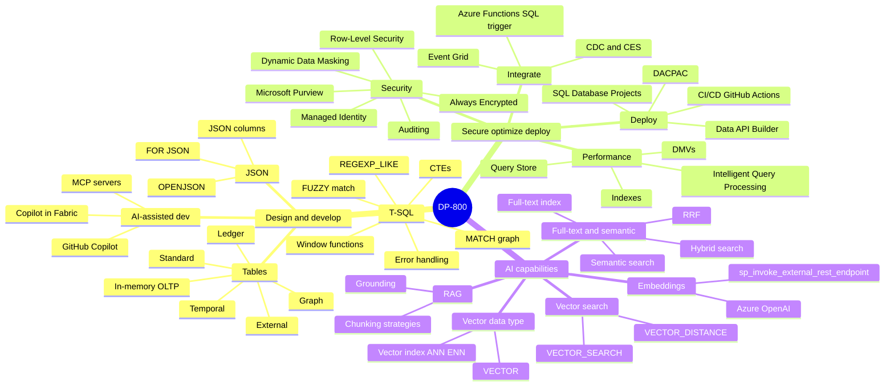
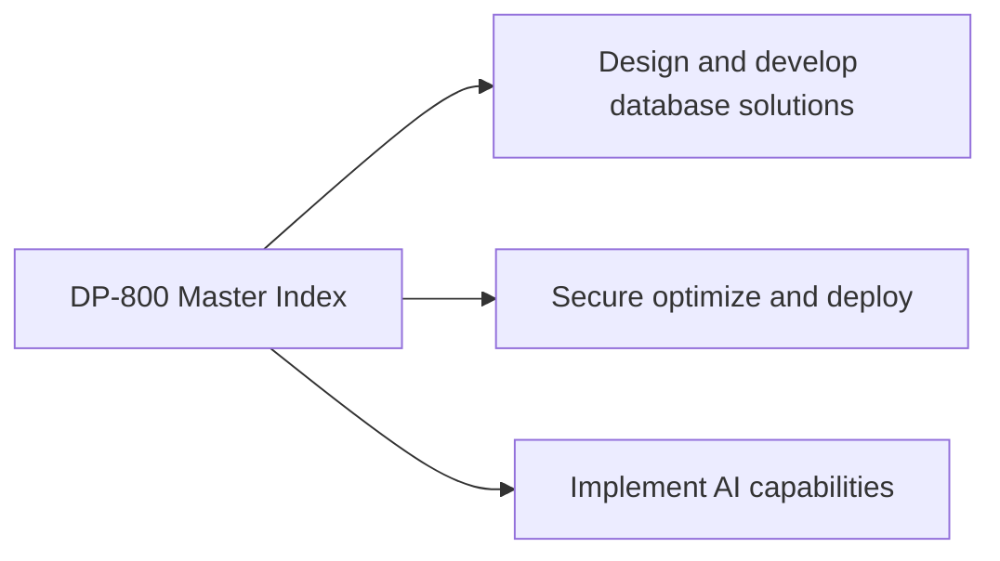
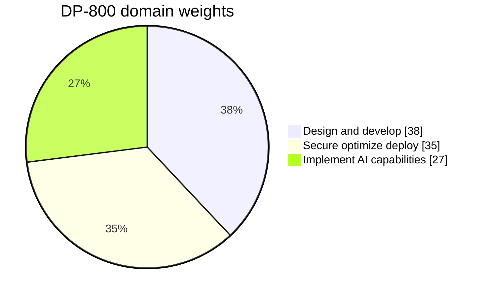

# DP-800 - Developing AI-Enabled Database Solutions - Visual Study Guide

> Concept-only study aid. No exam questions reproduced. Source PDF (if any) stays local + gitignored.

**Skills outline:** https://learn.microsoft.com/credentials/certifications/resources/study-guides/dp-800

> [!NOTE]
> DP-800 is the **beta exam** for the new Microsoft Certified: SQL AI Developer Associate. Beta exams may evolve - always check the latest skills outline.

## Master mind map

## Domain map

## Domain weights

## Recommended study order

```mermaid
gantt
    title Suggested study plan
    dateFormat X
    axisFormat Day %d
    section Plan
    Design and develop      :t1, 0, 4d
    Secure optimize deploy  :t2, after t1, 3d
    Implement AI            :t3, after t2, 3d
    Cheatsheet and review   :t4, after t3, 1d
```

---

**Next:** open [01-design-and-develop.md](01-design-and-develop.md)
