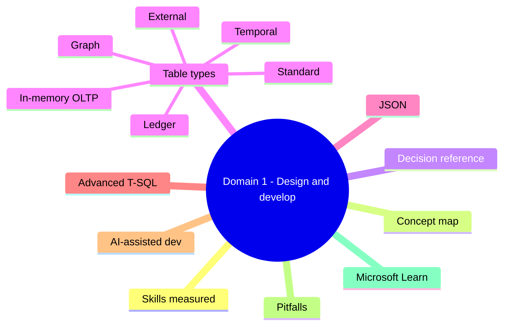
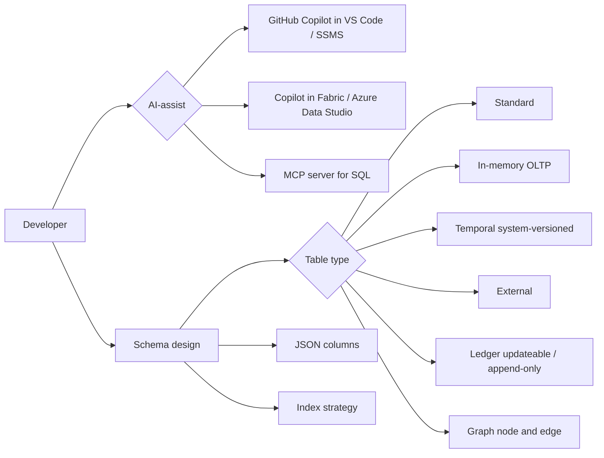

# Domain 1: Design and Develop Database Solutions

> Modern Azure SQL development: rich table types, JSON, advanced T-SQL, AI-assisted authoring.

## Domain mind map

## Skills measured

- Design tables, indexes, schemas in Azure SQL Database / Managed Instance / SQL Server.
- Implement in-memory OLTP, temporal, external, ledger, and graph tables.
- Manipulate JSON in T-SQL.
- Author advanced T-SQL: CTEs, window functions, REGEXP_LIKE, fuzzy match, MATCH, error handling.
- Use AI-assisted development tools (GitHub Copilot, Copilot in Fabric, MCP servers).

## Concept map

## Decision reference

| Need | Choice |
|---|---|
| Ultra-low latency point inserts | In-memory OLTP table |
| Track full history of every row | Temporal table |
| Query data in ADLS / S3 in place | External table (PolyBase / parquet) |
| Tamper-evident audit trail | Ledger table (append-only or updateable) |
| Many-to-many traversals | Graph node + edge tables with `MATCH` |
| Semi-structured payloads | NVARCHAR(MAX) + JSON functions or JSON column |
| Generate boilerplate from prompt | GitHub Copilot |
| Convert natural language to T-SQL | Copilot in Azure Data Studio / Fabric |
| Expose schema to AI agent | MCP server for SQL |

## Table types in depth

- **In-memory OLTP**: memory-optimized tables + natively compiled stored procs. Use for high-throughput insert / update workloads. Trade-off: row size limits, durability schema.
- **Temporal (system-versioned)**: hidden history table tracks every row version. Query with `FOR SYSTEM_TIME AS OF / BETWEEN / FROM ... TO`.
- **External tables**: read data in Azure Data Lake / blob / S3 without import. Use `CREATE EXTERNAL TABLE` + `EXTERNAL DATA SOURCE` + `FILE FORMAT`.
- **Ledger tables**: cryptographic Merkle tree audit trail. Two flavors:
  - **Updateable ledger** - allows updates, history kept.
  - **Append-only ledger** - immutable inserts only.
- **Graph tables**: `CREATE TABLE ... AS NODE` and `AS EDGE`; query with `MATCH` clause + shortest path functions.

## JSON in T-SQL

- `OPENJSON(@json)`: parse JSON into rows; supply `WITH` schema for typed projection.
- `JSON_VALUE(@json, '$.path')`: extract scalar.
- `JSON_QUERY(@json, '$.path')`: extract object/array.
- `JSON_MODIFY(@json, '$.path', value)`: set/insert/delete.
- `FOR JSON PATH / AUTO`: serialize result set to JSON.
- **JSON data type** (modern SQL Server / Azure SQL): native JSON column with validation.

## Advanced T-SQL

- **CTEs**: `WITH cte AS (SELECT ...) SELECT ... FROM cte`. Recursive CTEs for hierarchies.
- **Window functions**: `ROW_NUMBER()`, `RANK()`, `LAG()`, `LEAD()`, `SUM(...) OVER (PARTITION BY ... ORDER BY ...)`.
- **REGEXP_LIKE / REGEXP_COUNT / REGEXP_INSTR / REGEXP_REPLACE**: regex pattern matching (modern Azure SQL).
- **Fuzzy match**: similarity functions (e.g., `SOUNDEX`, `DIFFERENCE`, `EDIT_DISTANCE`).
- **MATCH** (graph): `SELECT * FROM Person p, Likes l, Person p2 WHERE MATCH(p-(l)->p2)`.
- **Error handling**: `BEGIN TRY ... END TRY BEGIN CATCH ... END CATCH`, `THROW`, `XACT_STATE()`.

## AI-assisted database development

- **GitHub Copilot** in VS Code / SSMS: completes T-SQL, generates stored procedures from prompts.
- **Copilot in Azure Data Studio**: chat-with-database; convert natural language to T-SQL, explain query plans.
- **Copilot in Fabric SQL**: ditto for Fabric mirrored SQL.
- **MCP server for SQL**: expose schema + tools to AI agents (Claude, Copilot) via the Model Context Protocol.

## Common pitfalls

- Memory-optimized table without enough memory -> degraded perf or insert failures.
- Temporal history table grows forever -> set retention policy.
- External tables not push-down enabled -> full data shipped to engine.
- Ledger updateable vs append-only confusion -> wrong audit semantics.
- JSON_VALUE with `lax` (default) silently returns NULL on missing path; use `strict` to error.
- Recursive CTE without termination -> hits 100-iteration default cap.
- Trusting Copilot output without compiling + testing -> plausible but wrong T-SQL.

## Microsoft Learn

- [In-memory OLTP](https://learn.microsoft.com/sql/relational-databases/in-memory-oltp/in-memory-oltp-in-memory-optimization)
- [Temporal tables](https://learn.microsoft.com/sql/relational-databases/tables/temporal-tables)
- [External tables](https://learn.microsoft.com/sql/relational-databases/polybase/polybase-guide)
- [Ledger](https://learn.microsoft.com/sql/relational-databases/security/ledger/ledger-overview)
- [Graph in SQL](https://learn.microsoft.com/sql/relational-databases/graphs/sql-graph-overview)
- [JSON in SQL](https://learn.microsoft.com/sql/relational-databases/json/json-data-sql-server)
- [GitHub Copilot for SQL](https://learn.microsoft.com/azure/azure-sql/copilot/)

---

**Next:** [02-secure-optimize-deploy.md](02-secure-optimize-deploy.md)
