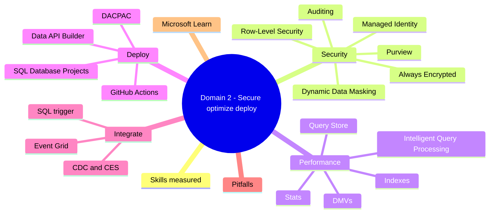
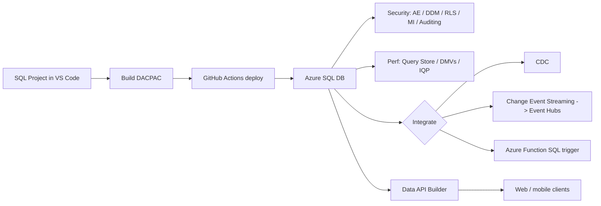

# Domain 2: Secure, Optimize, and Deploy Database Solutions

> Production hardening: security, performance, and CI/CD for Azure SQL.

## Domain mind map

## Skills measured

- Implement security controls: Always Encrypted, DDM, RLS, MI, auditing.
- Use Query Store, DMVs, IQP for performance tuning.
- Develop and deploy with SQL Database Projects + GitHub Actions.
- Implement Data API Builder.
- Integrate via CDC, Change Event Streaming (CES), Azure Functions SQL trigger.

## Concept map

## Decision reference

| Need | Choice |
|---|---|
| Encrypt sensitive data so DB engine cannot read it | Always Encrypted (AE) |
| Mask data for non-privileged users | Dynamic Data Masking (DDM) |
| Filter rows per user | Row-Level Security (RLS) |
| App connects without a password | Managed Identity (system or user-assigned) |
| Track DDL / DML / login events | Auditing -> Log Analytics / Storage |
| Catch slow queries | Query Store + Top Resource Consumers |
| Stream row changes to Event Hubs | Change Event Streaming (CES) |
| Stream row changes via polling table | CDC + ETL |
| React in code to row insert/update/delete | Azure Functions SQL trigger |
| Auto-generate REST + GraphQL on schema | Data API Builder (DAB) |

## Security

- **Always Encrypted (AE)**: client-side encryption with column master/encryption keys; keys in Key Vault. Engine sees only ciphertext.
  - **AE with secure enclaves** allows rich queries on encrypted data.
- **Dynamic Data Masking (DDM)**: mask presentation only; underlying data unchanged. Roles like `UNMASK` see plaintext.
- **Row-Level Security (RLS)**: predicate function applied at table level; transparent to apps.
- **Managed Identity**: assign system or user-assigned MI to App Service / Functions / VM; grant Azure SQL `db_datareader` etc. via Microsoft Entra group.
- **Auditing**: server- or DB-level; sink to Log Analytics, Storage, Event Hubs.
- **Microsoft Purview**: data discovery + classification + lineage across SQL, ADLS, Fabric.

## Performance

- **Query Store**: built-in flight recorder; per-DB. View top resource consumers, regression queries, plan changes.
- **DMVs**: `sys.dm_exec_query_stats`, `sys.dm_db_index_usage_stats`, `sys.dm_os_wait_stats`.
- **Intelligent Query Processing (IQP)**: adaptive joins, batch mode on rowstore, memory grant feedback, parameter sensitivity plan optimization (PSP).
- **Indexes**: clustered, nonclustered, columnstore, filtered. Use **Missing Index DMVs** as starting hints.
- **Statistics**: auto-updated; `UPDATE STATISTICS` after big loads.

## SQL Database Projects

- VS Code extension authors `.sqlproj` with table / view / proc files.
- Build -> DACPAC; deploy via `sqlpackage` or GitHub Actions.
- Pre / post-deployment scripts for data and reference seeds.
- Schema compare for drift detection.

## CI/CD with GitHub Actions

- Workflow: build DACPAC -> deploy to Dev / Test / Prod with environments + approvals.
- Use **Microsoft Entra federated credentials** (no PAT or secret) via OIDC.
- Use a Managed Identity on a self-hosted runner or `azure/login@v2` action.

## Data API Builder (DAB)

- Generates REST + GraphQL endpoints from a schema config file.
- Supports CRUD, filtering, pagination, RLS-aware.
- Run as container or Azure Functions / Container Apps.
- Configurable auth (Entra ID, JWT).

## CDC, CES, and SQL trigger

- **CDC (Change Data Capture)**: classic - changes captured into shadow tables; ETL polls.
- **CES (Change Event Streaming)** (modern Azure SQL): pushes row changes to **Event Hubs** as JSON events. Use for real-time analytics.
- **Azure Functions SQL trigger**: event-driven function fires on table changes (uses change tracking under the hood).
- **Event Grid integration**: Azure SQL DB resource events (DB created, paused, etc.).

## Common pitfalls

- AE without enclave + complex predicates -> queries fail; switch to AE with secure enclaves.
- DDM treated as security boundary -> a privileged user with `UNMASK` sees plaintext; not a substitute for AE.
- RLS predicate using `USER_NAME()` not `SESSION_CONTEXT()` -> breaks under app user mapping.
- Forgetting to enable Query Store -> blind to perf regressions.
- DACPAC deployment with `BlockOnPossibleDataLoss=true` blocks every drop column.
- DAB exposed without auth -> public CRUD on DB.
- Functions SQL trigger requires Change Tracking enabled.

## Microsoft Learn

- [Always Encrypted](https://learn.microsoft.com/sql/relational-databases/security/encryption/always-encrypted-database-engine)
- [Dynamic Data Masking](https://learn.microsoft.com/azure/azure-sql/database/dynamic-data-masking-overview)
- [Row-Level Security](https://learn.microsoft.com/sql/relational-databases/security/row-level-security)
- [Managed Identity for Azure SQL](https://learn.microsoft.com/azure/azure-sql/database/authentication-mi-overview)
- [Query Store](https://learn.microsoft.com/sql/relational-databases/performance/monitoring-performance-by-using-the-query-store)
- [SQL Database Projects](https://learn.microsoft.com/sql/azure-data-studio/extensions/sql-database-project-extension)
- [Data API Builder](https://learn.microsoft.com/azure/data-api-builder/overview)
- [Change Event Streaming](https://learn.microsoft.com/azure/azure-sql/change-event-streaming)
- [Azure Functions SQL trigger](https://learn.microsoft.com/azure/azure-functions/functions-bindings-azure-sql-trigger)

---

**Next:** [03-implement-ai-capabilities.md](03-implement-ai-capabilities.md)
