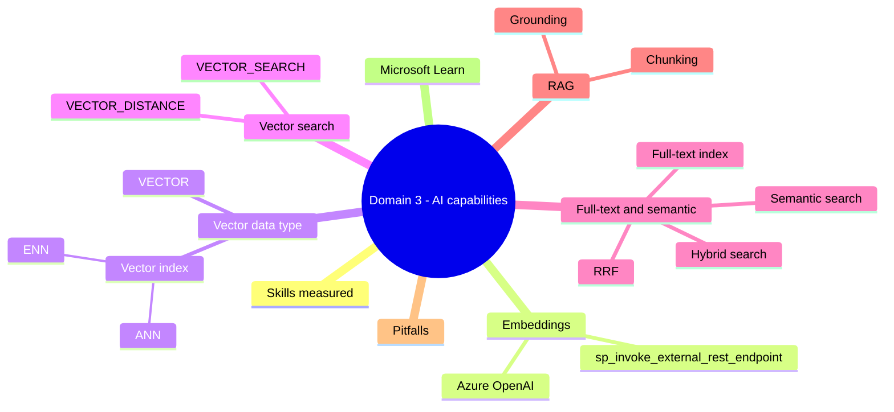
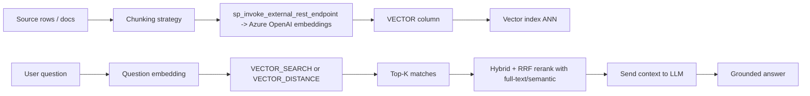

# Domain 3: Implement AI Capabilities

> Embeddings, vector data type, vector / semantic / hybrid search, and RAG inside Azure SQL.

## Domain mind map



## Skills measured

- Generate and store embeddings via REST in Azure SQL.
- Use the VECTOR data type and vector indexes.
- Query with VECTOR_DISTANCE and VECTOR_SEARCH.
- Combine full-text, semantic, and vector search (hybrid + RRF).
- Build RAG inside Azure SQL.

## Concept map



## Decision reference

| Need | Choice |
|---|---|
| Generate embeddings from inside SQL | `sp_invoke_external_rest_endpoint` -> Azure OpenAI |
| Store embedding fixed-dim vector | VECTOR(N) data type |
| Approximate nearest neighbor (fast, recall trade) | Vector index with **ANN** |
| Exact nearest neighbor | **ENN** scan or no index |
| Distance between two vectors | `VECTOR_DISTANCE('cosine', a, b)` |
| Top-K nearest by query vector | `VECTOR_SEARCH(...)` |
| Boolean / phrase keyword | Full-text index + CONTAINS |
| Concept-based ranking | Semantic search |
| Best of both | Hybrid (vector + full-text) + RRF |
| Ground LLM answers in DB content | RAG inside SQL |

## Embeddings via REST

- **`sp_invoke_external_rest_endpoint`** issues HTTP from inside the engine.
- Auth via `DATABASE SCOPED CREDENTIAL` (Managed Identity preferred).
- Pattern:

```sql
DECLARE @payload NVARCHAR(MAX) = JSON_OBJECT('input': @text, 'model': 'text-embedding-3-small');
DECLARE @response NVARCHAR(MAX);
EXEC sp_invoke_external_rest_endpoint
    @url = 'https://<yourresource>.openai.azure.com/openai/deployments/<deploy>/embeddings?api-version=2023-05-15',
    @method = 'POST',
    @payload = @payload,
    @credential = [https://<yourresource>.openai.azure.com],
    @response = @response OUTPUT;
SELECT JSON_VALUE(@response, '$.result.data[0].embedding') AS embedding;
```

## VECTOR data type

- `VECTOR(N)`: fixed-dimension float vector (commonly 1536 or 3072 for `text-embedding-3-small / large`).
- Stored compactly; converts to/from JSON arrays.
- Index types:
  - **ANN (Approximate Nearest Neighbor)** - fast, recall<100%.
  - **ENN (Exact Nearest Neighbor)** - exhaustive, precise.

## Vector search

- `VECTOR_DISTANCE('cosine' | 'euclidean' | 'dot', v1, v2)` returns scalar.
- `VECTOR_SEARCH` returns top-K rows ordered by distance from a query vector.

```sql
SELECT TOP 10 id, content
FROM Docs
ORDER BY VECTOR_DISTANCE('cosine', embedding, @qvec);
```

## Full-text + semantic + hybrid

- **Full-text index** on text column -> `CONTAINS(col, 'phrase')` or `FREETEXT(col, 'about cats')`.
- **Semantic search** (where supported): `SEMANTICKEYPHRASETABLE`, `SEMANTICSIMILARITYTABLE`.
- **Hybrid search**: combine full-text or semantic results with vector results.
- **RRF (Reciprocal Rank Fusion)**: score = `sum(1/(k + rank_i))` across rankers; merges heterogeneous lists fairly.

## RAG inside Azure SQL

1. Chunk documents (overlap 10-15% common).
2. Embed each chunk; store with `VECTOR` column.
3. At query time: embed user question -> vector search top-K.
4. Assemble context -> call Azure OpenAI completion via `sp_invoke_external_rest_endpoint`.
5. Return grounded answer + citations to source rows.

- Combine with **RLS** so a user only retrieves chunks they can see.
- Combine with **Always Encrypted** if chunks themselves contain sensitive data (keys at client).

## Common pitfalls

- Embedding dimension mismatch (1536 vs 3072) -> all distances meaningless.
- Vector index built before column populated -> rebuild needed.
- Cosine vs euclidean confusion -> rankings flip.
- Skipping chunk overlap -> answers truncated at boundary.
- RAG without citation columns -> users cannot verify.
- Calling Azure OpenAI without exponential backoff -> 429 storms.
- Using full-text only on multilingual content -> recall drop; semantic / vector helps.

## Microsoft Learn

- [Vectors in Azure SQL](https://learn.microsoft.com/azure/azure-sql/database/vector-search)
- [`sp_invoke_external_rest_endpoint`](https://learn.microsoft.com/sql/relational-databases/system-stored-procedures/sp-invoke-external-rest-endpoint-transact-sql)
- [Full-text search](https://learn.microsoft.com/sql/relational-databases/search/full-text-search)
- [Azure OpenAI embeddings](https://learn.microsoft.com/azure/ai-services/openai/concepts/understand-embeddings)
- [RAG in Azure SQL DB](https://learn.microsoft.com/azure/azure-sql/database/ai-artificial-intelligence-intelligent-applications)

---

**Next:** [05-exam-cheatsheet.md](05-exam-cheatsheet.md)
