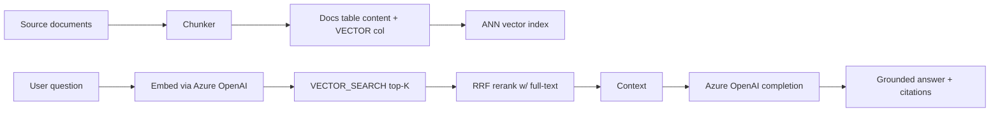
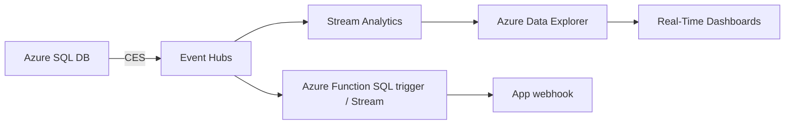
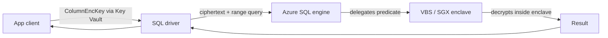
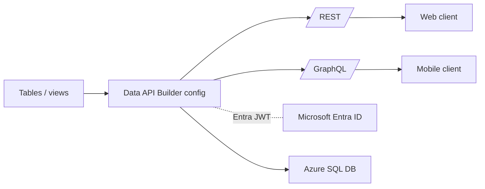

# DP-800 Reference Architectures

> Canonical AI-enabled database patterns. Memorize the shapes.

## 1. RAG inside Azure SQL

## 2. Streaming change architecture

- CES pushes JSON row events; Stream Analytics aggregates; ADX retains hot.

## 3. CI/CD with SQL Database Projects

```mermaid
flowchart LR
    Dev[VS Code .sqlproj] --> PR[Pull Request]
    PR --> CI[GitHub Actions build]
    CI --> Dac[DACPAC artifact]
    Dac --> DepDev[Deploy to Dev DB]
    DepDev --> Test[Schema + integration tests]
    Test --> Approval[Environment approval]
    Approval --> Prod[Deploy to Prod DB]
    Prod -. OIDC federated cred .- AzAD[Microsoft Entra]
```

## 4. Always Encrypted with secure enclaves

## 5. Data API Builder front-end

---

[Master Index](00-MASTER-INDEX.md)
